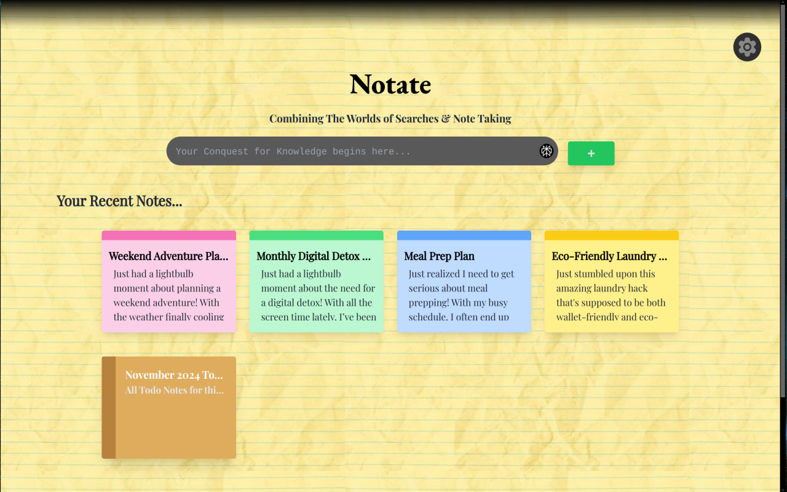
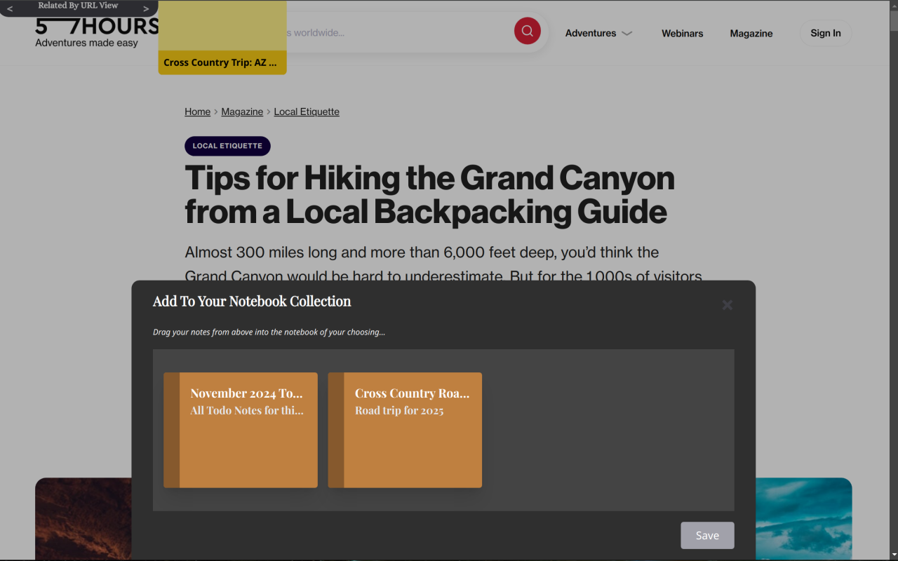
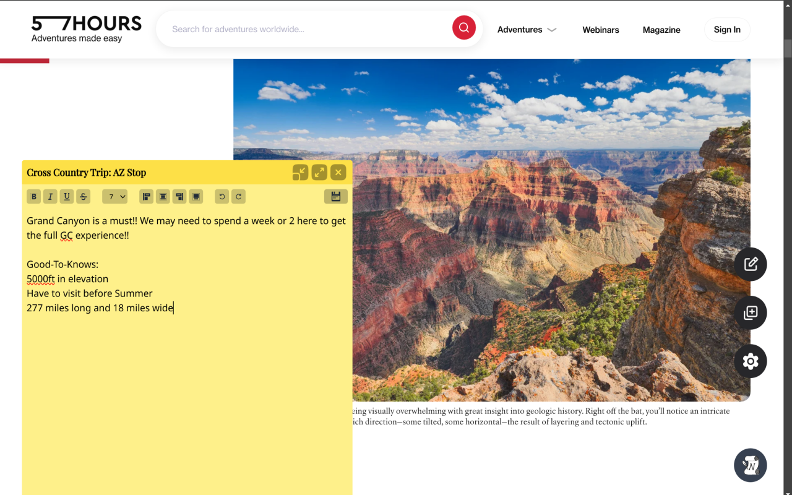

# Notate

<div align="center">

[](CONTRIBUTING.md)
[](CONTRIBUTING.md)
[](CONTRIBUTING.md)
[](LICENSE)

</div>

> 🚧 **Active Development - Contributors Needed!** 
>
> We're actively seeking contributors to help with Firefox compatibility! If you're passionate about browser extensions and want to make an impact, check out our [Help Wanted](#help-wanted) section.

Jot your ideas, discoveries, research notes, or practically anything! Without leaving your browser! Enter Notate, your web navigation partner! 
Notate is a powerful browser extension that seamlessly integrates note-taking and web browsing.

[Quick Links: [Contributing](#contributing) | [Firefox Support Status](#browser-support) | [Development Guide](#development)]

---

## Showcase

<div align="center">
  
  <p><em>Create and organize notes directly from your new tab page</em></p>
  <table>
    <tr>
      <td align="center">
        
        <p><em>Organize notes into notebooks</em></p>
      </td>
      <td align="center">
        
        <p><em>Intelligent note suggestions</em></p>
      </td>
    </tr>
  </table>
</div>

## Table of Contents

- [Features](#features)
- [Installation](#installation)
- [Usage](#usage)
- [Development](#development)
- [Technology Stack](#technology-stack)
- [Inspiration](#inspiration)
- [Browser Support](#browser-support)
- [Contributing](#contributing)
- [License](#license)

## Features

- **Instant Note-Taking**: Create notes directly from your new tab page.
- **Web-Wide Accessibility**: Access your notes across all web pages.
- **Notebook Organization**: Centralize and categorize your thoughts with Notebooks.
- **Intelligent Suggestions**: Receive smart recommendations for note organization as you write.
- **Seamless Integration**: Enjoy a smooth, non-disruptive browsing and note-taking experience.

## Installation

### Method 1: Installing from GitHub

1. Clone the repository:
   ```bash
   git clone https://github.com/h8ngrydev4hire/notate.git
   ```
2. Navigate to your browser's extensions page:
   - Chrome: `chrome://extensions`
   - Firefox: `about:addons`
3. Enable Developer Mode.
4. Back in your File Explorer, head over to the `./bin` directory from the project root
5. Simply drag'n'drop the `Notate.crx` file into the extensions page of your browser.


### Method 2: Installing from Web Stores

> Note: Notate is currently not available on Chrome Web Store or Mozilla Add-ons. Stay tuned for updates on official store releases.

> UPDATE (11/17/24): Notate is currently in the process of being reviewed for public release on the Chrome Web Store. More updates will follow once we hear back from their team!

## Usage

1. Click the Notate icon in your browser toolbar to activate the extension.
2. Open a new tab to access the Notate interface.
3. Start creating notes, organizing them into notebooks, and exploring Notate's features.


## Development

To set up a development build:

1. Install dependencies:
   ```bash
   npm i 
   ```
2. run the build script:
   ```bash
   npm run dev
   ```
3. Build script creates `./prod` directory which you can load into the Chrome browser for further development. 

## Technology Stack

### FRONTEND LAYER

**Framework:** React.JS 18

**Styling:** TailwindCSS

**State Mgmt:**

- React Context API
- Custom React Hooks

### APPLICATION LAYER

**Service Worker:**

- Background Service

**Business Logic:**

- User Content Mgmt System
- Note Relationship Algorithm Engine
- User Configuration Mgmt

**Backend API**

- Chrome Extension API


### DATA LAYER

**Database Framework**

- IndexedDB
- Chrome Storage API

**Data Types**

- Notes / Notebooks

### DEVELOPMENT BUILD TOOLS

**Build System:** Webpack

**Package Mgmt System:** Npm

**Version Control System:** Git

**Additional Tools:**

- Babel
- PostCSS
- Custom Build / Test Scripts


## Inspiration

This is a React.js project that was originally supposed to be written using JQuery but I soon realized that the mountains of code was starting to become very cumbersome!! After 2 weeks of hard work put into the project, I had made the ultimate decision to begin my React.js Journey by rewriting my initial code in React and seeing this project to completion. This project has no other dependencies besides the required ones such as react, tailwindcss, webpack, etc. After almost 7 months of blood, sweat, tears, and maybe some dented desks (sorry desk... :\ ), I am very proud to announce the 1st iteration of my Application/Extension!

## Browser Support

This project was written originally for Chromium-based Web Browsers, but also has active development for Gecko-based (Firefox) Browsers. Please review our [HELP-WANTED.md](https://github.com/h8ngryDev4Hire/notate/blob/main/HELP-WANTED.md) for Firefox's current development status.

## Contributing

We welcome contributions to Notate! Please read our [Contributing Guidelines](CONTRIBUTING.md) for details on our code of conduct and the process for submitting pull requests.

## License

This project is licensed under the MIT License - see the [LICENSE](LICENSE) file for details.
